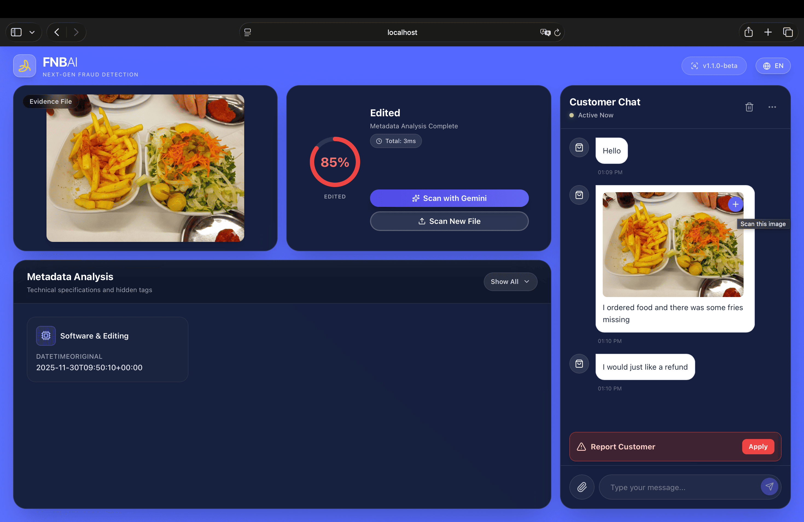
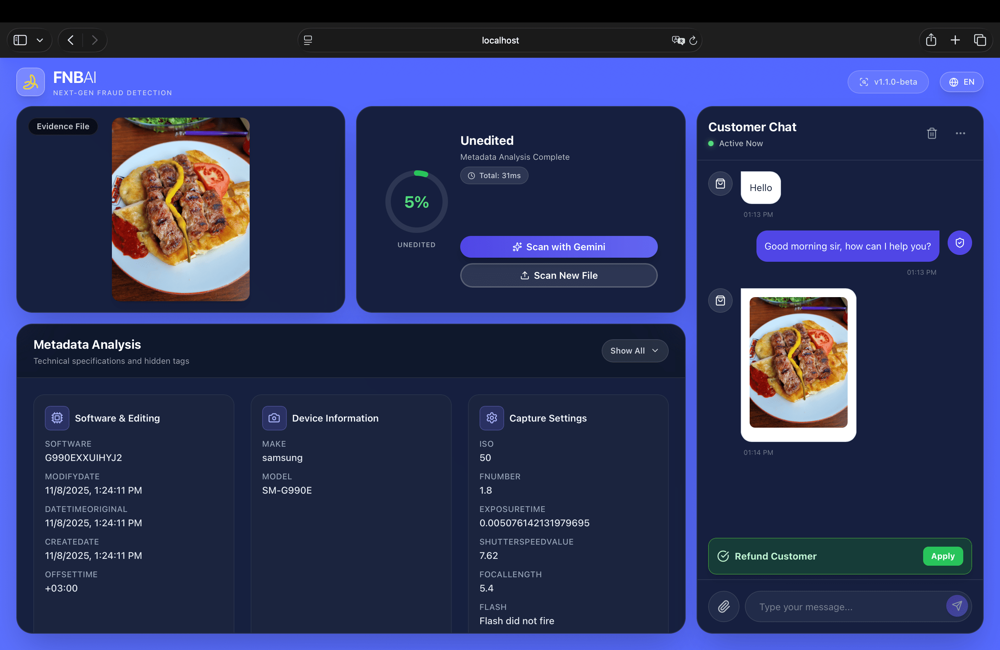
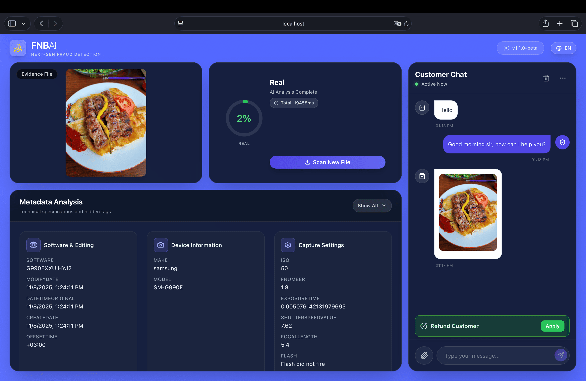

<div align="center">
  

  # Food Delivery Fraud Detector

  <p>
    A specialized forensic tool for food delivery platforms to detect fraudulent refund claims involving AI-generated or manipulated food images.
  </p>
</div>

As of November 2025, the food delivery industry is battling a sophisticated wave of refund fraud. Scammers are leveraging next-generation AI models like **Nano Banana Pro** to generate hyper-realistic images of spoiled, spilled, or incorrect orders. These "evidence" photos are often indistinguishable from reality to the naked eye.

This application serves as a defense mechanism, combining metadata forensics with advanced AI analysis to determine if a submitted image is a genuine photo of a delivery or a synthetic fabrication.

## Project Context

While Google's SynthID technology is a key defense, this application provides a comprehensive verification layer using Google AI Studio's Gemini API. It is specifically tuned to identify the subtle artifacts left by models like Nano Banana Pro, which are popular in underground fraud communities for generating "proof" of ruined food.

## How It Works

The application employs a two-stage detection system optimized for food photography:

1. **Metadata Forensics:** Examines EXIF data using `exifr` to identify anomalies. Real delivery photos usually contain specific smartphone camera data. We look for missing camera info, traces of editing software (often used to "spoil" food digitally), and timestamp inconsistencies relative to the delivery time.

2. **AI Visual Analysis:** Leverages Google's Gemini 3 Pro model to detect visual artifacts. It looks for SynthID also "dream-like" textures in food, symmetry anomalies in packaging, and lighting inconsistencies that betray a generated image.

Each analysis produces a verdict ("Likely AI-Generated", "Likely Authentic", or "Inconclusive"), a confidence score, and detailed reasoning to support the refund decision.

## Features

- **Fraud Detection Pipeline:** Specialized for identifying fake "spilled drink" or "wrong item" photos.
- **Metadata Forensics:** Detects if an image was edited to look worse or generated from scratch.
- **Interactive Verification:** Drag-and-drop interface for support agents to quickly check claims.
- **Zoomable Inspection:** Detailed view to spot AI artifacts in food textures.
- **Refund Simulation:** Chat interface simulating a customer support interaction for training and testing.
- **Audit Logging:** Tracks analysis history for dispute resolution.
- **Detailed Reports:** Evidence-based reasoning to justify refund approvals or denials.

## Screenshots

### Refund Verification Workflow

**1. Edited Image Detection (Fraud Attempt)**

*The system detects metadata anomalies in a photo submitted for a "refund" claim. The metadata reveals traces of editing software, suggesting the user digitally altered a photo to get a refund. The process stops here; the claim is flagged.*

**2. Unedited Image Submission**

*The customer is asked to provide the original, unedited photo from their camera roll to proceed with the claim.*

**3. AI Authenticity Confirmation (Valid Claim)**

*Gemini 3 Pro analyzes the unedited image. It checks for the specific visual signatures of Nano Banana Pro and other generators. Finding none, it determines the image is "Likely Authentic". The food is genuinely spoiled, and the refund is approved.*

## Tech Stack

- **Frontend:** React 19, TypeScript, Vite
- **Styling:** Tailwind CSS
- **AI Integration:** Google Gemini API (`@google/genai`)
- **Metadata Parsing:** `exifr`
- **Icons:** Lucide React

## Prerequisites

- Node.js (v18 or higher)
- Google Gemini API key (obtain from [Google AI Studio](https://aistudio.google.com/))

## Installation

1. **Clone the repository:**
   ```bash
   git clone <your-repo-url>
   cd <your-repo-name>
   ```

2. **Navigate to the project directory:**
   ```bash
   cd FrontEnd
   ```

3. **Install dependencies:**
   ```bash
   npm install
   ```

4. **Configure your API key:**
   
   Create a `.env.local` file in the `FrontEnd` directory:
   ```env
   GEMINI_API_KEY=your_actual_api_key_here
   ```

5. **Start the development server:**
   ```bash
   npm run dev
   ```

6. **Access the application:**
   
   Open your browser to `http://localhost:3000`

## Project Structure

```
FrontEnd/
├── components/              # React components
│   ├── ChatSection.tsx      # Chat interface for customer simulation
│   ├── ExifDisplay.tsx      # EXIF metadata display component
│   ├── ImageUploader.tsx    # Image upload interface
│   ├── ResultDisplay.tsx    # Analysis results component
│   └── ...
├── services/                # Core services and business logic
│   ├── exifService.ts       # EXIF metadata analysis
│   ├── geminiService.ts     # Gemini AI integration
│   └── messageBus.ts        # Inter-component communication
├── App.tsx                  # Root application component
├── vite.config.ts           # Vite configuration
└── ...
```

## Usage

1. **Upload a claim photo** using the drag-and-drop interface.

2. **Analysis pipeline:**
   - EXIF metadata scan checks for editing or stripped metadata (common in generated images).
   - AI visual analysis looks for "Nano Banana Pro" artifacts in the food items.
   - Results are combined for a final determination.

3. **Review findings:**
   - **Verdict:** Authentic (Approve Refund) vs. AI/Edited (Deny Refund).
   - **Confidence:** How sure the system is.
   - **Reasoning:** Detailed explanation for the support agent.

## Future Development

As scammers evolve from Nano Banana Pro to newer models, this tool will be updated with specific detection signatures. Future versions will integrate directly with food delivery platform APIs to automate the refund decision process based on the fraud score.

## Contributing

Contributions are welcome! Please feel free to submit a Pull Request.

## License

This project is licensed under the MIT License - see the [LICENSE](LICENSE) file for details.

## Acknowledgments

- Inspired by Google's SynthID watermarking technology
- Powered by Google Gemini API
- Built with React and modern web technologies

---

**Note:** This tool is for educational and demonstration purposes. While it provides analysis based on metadata and AI detection, no detection system is 100% accurate. Always use multiple verification methods for critical authenticity assessments.